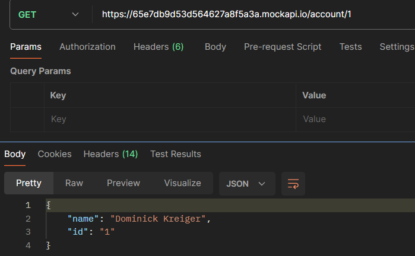

# Money transfer API
1. Account Validation URL endpoint that used to validate account number and
   name of the bank account owner. To validate the account, please create a
   mock endpoint using https://mockapi.io/ or other preferred service that will act
   as a bank.
2. Transfer/Disbursement URL endpoint that used to transfer money to the
   destination account. To transfer the money, you can create a mock endpoint
   similar to point 1 that acts as a bank.
3. Transfer/Disbursement Callback URL endpoint that used to receive callback
   status of transfer from the bank.

# Functional Requirements
## User Stories
- As a Merchant Owner in Payment Gateway system
  - I want to be able to validate bank account number and name via an endpoint so that I can ensure the account details are correct before making transactions.
  - I want to transfer money to a different account via a dedicated endpoint so that I can complete transactions without visiting the bank.

- As an Admin of Payment Gateway system
  - I want the system to handle duplicate referenceId for transfer so double transaction can be avoided.
  - I want the system to track transaction statuses and bank transaction references so that I can keep a precise record of all transaction.
  - I want the system to be capable of receiving transfer request and handling properly even in high traffic.
  - I want the system to be capable of receiving callback and handling considerable traffic so that I can maintain security and integrity in bank transaction.
  - I want the system to be capable of validating account number before transfer the money.
  - I want the system to be capable of handling failure in transaction and restore user balance.

## Use Cases
### 1. Validate Bank Account
  - Actor: Merchant Owner
  - Preconditions: User possesses a bank account and the system has access to Bank / External API.
  - Main Flow: User input account number and bank the name of the bank account owner into the system. The system sends this information to the validation endpoint of the external API. The external API returns additional name info if correct. The system confirms the validation status back to the user.
  - Alternative Flow: If the account validation fail, the user are not allow to process the transaction.
  - Post-conditions: Account validation status is stateless, system have to validate every-time user want to create new transaction.

### 2. Transfer Money
  - Actor: Merchant Owner
  - Preconditions: User's and destination account is validated and the system has access to Bank / External API.
  - Main Flow: User input the amount and account detail that they are going to transfer. The system will deduct the balance of the merchant that stored to the system when it's done.
  - Alternative Flow: If the money transfer fails or destination account is not exist, inform the user to check the input data.
  - Post-conditions: Transaction either is done or failed, and the result of the transaction is stored in the system.

### 3. Receive Transaction Status Callback
  - Actor: System
  - Preconditions: A transaction request has been made and the system awaits the response from Bank / External API.
  - Main Flow: The external API sends the transaction status to the system's callback endpoint. The system updates the transaction record and ledger based on the received callback status.
  - Alternative Flow: If the callback information is not received within a certain timeframe, the system should repeat the request or handle this situation according to the business rules.
  - Post-conditions: The transaction status has been handled and recorded in the system.

## Requirement Categories
### Data Management
#### 1. Data Storage
- The system should use a relational database for storage of user data. The database should be properly indexed to ensure high performance. This also give us an advantage of ACID and transactional query support.
- As a system, I should store user data management in a PostgreSQL relational database to provide reliability and efficiency in data processing.
- 

#### 2. Data Validation
- The system should validate any user-entered data to ensure it's correctness and completeness before storing it in the database.
- As a system, I validate user input data in multiple layer and also in OpenAPI specification

### Integration Flow
#### 1. Account Validation

#### 2. Transfer

# Non-Functional Requirement
- Scalable system to adapt when traffic is significantly high

# Case Scenario
### 1. Validate Account
   - Hit GET http://localhost:8080/v1/account/validate
   - required: query param `bank_code` and `account_number`
### 2. Transfer with callback
   - Hit POST http://localhost:8080/v1/transfer
   - Copy `bank_ref_id` from DB
   - Hit POST http://localhost:8080/v1/callback/transfer with copied `bank_ref_id`, desired `status`
     - required: set header request `Signature` to `brick`
   - Transfer will be successful in table `transfer`, data in table `ledger` also created
### 3. Retry and throw to DLQ
   - Make mock endpoint data of transfer endpoint full https://mockapi.io/projects/65e7db9d53d564627a8f5a3b#
   - Hit POST http://localhost:8080/v1/transfer
   - After it reach 5 times, it will be sent to DLQ (ref: `aws --endpoint-url=http://localhost:4566 sqs get-queue-attributes --queue-url http://localhost:4566/000000000000/record-transaction --attribute-names All`)
### 4. Retry consume and success
   - Make mock endpoint data of transfer endpoint full https://mockapi.io/projects/65e7db9d53d564627a8f5a3b#
   - Hit POST http://localhost:8080/v1/transfer
   - Consumer fail to process transfer to bank temporary
   - In the halfway, change mock endpoint data of transfer endpoint to half-empty
   - Consumer successfully process transfer to bank
### 5. Bank never send the callback
   - Hit POST http://localhost:8080/v1/transfer
   - Make sure `transfer status checker cron` is running
   - Without hitting callback endpoint, transfer will be success eventually.

# Mock Endpoint
BANK_BASE_URL: https://65e7db9d53d564627a8f5a3a.mockapi.io
- GET Account Endpoint

- POST Transfer Endpoint

# How to run locally
## Prerequisite
1. `go` - version 1.21
2. `docker` - for building docker images (can be installed with docker desktop).
3. `docker-compose` - for setting/spinning up dev https://docs.docker.com/compose/install/
4. `make` - you already have it (if you are running on Mac/*nix system). https://community.chocolatey.org/packages/make

## Running the project
1. `make init` - re/create project resource including container, db schema, queue, and data
2. `make run` - run server
3. `make worker-1` - run transfer request consumer
4. `make worker-2` - run record transaction consumer
5. `make worker-3` - run pending transfer status checker cron